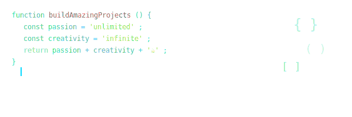
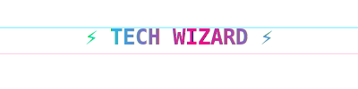

<!-- Cinematic Animated Header with Particle System -->

  

  

  

<!-- Visitor Counter with Real-time Stats -->

  
  

<!-- Enhanced Live Stats Section -->

  

<!-- Interactive Snake Game -->

  

<!-- Animated Wave Divider -->

  

<!-- Dynamic Tech Stack with Animated Icons -->
## 🚀 AI-Powered Tech Arsenal

  

<!-- Interactive Skill Progress Bars -->
<table align="center" width="100%">
  <tr>
    <td align="center" width="25%">
      <b>🤖 AI Engineering</b> 
      
       GPT-4, Gemini, LangChain, Vector DBs
    </td>
    <td align="center" width="25%">
      <b>⚡ Automation</b> 
      
       GitHub Actions, N8N, Zapier, Custom APIs
    </td>
    <td align="center" width="25%">
      <b>🌐 Full Stack</b> 
      
       React, Next.js, Node.js, TypeScript
    </td>
    <td align="center" width="25%">
      <b>☁️ Cloud Native</b> 
      
       AWS, GCP, Docker, Kubernetes
    </td>
  </tr>
</table>

<!-- Real-time Language Stats -->

  
  

<!-- Achievement Badges -->

  

<!-- Live Activity Dashboard -->
## 🎵 Real-Time Life Dashboard

<table align="center" width="100%">
  <tr>
    <td align="center" width="33%">
      <b>🎧 Currently Jamming To</b> 
      
       🎵 Coding beats and lo-fi vibes
    </td>
    <td align="center" width="33%">
      <b>⚡ Live Coding Activity</b> 
      
       📊 Real-time contribution patterns
    </td>
    <td align="center" width="33%">
      <b>🌍 Global Impact</b> 
      
      
       🚀 Building connections worldwide
    </td>
  </tr>
</table>

<!-- Weather Widget -->

  
  
  

---

## 💼 Impact & Excellence Metrics

<table align="center" width="100%">
  <tr>
    <td align="center" width="20%">
      
       <b style="font-size:2.5em;color:#00D8FF">300%</b>
       <b>Maximum ROI Achieved</b>
       AI-driven restaurant optimization
    </td>
    <td align="center" width="20%">
      
       <b style="font-size:2.5em;color:#00D8FF">95%</b>
       <b>Time Savings Delivered</b>
       Automation & AI workflows
    </td>
    <td align="center" width="20%">
      
       <b style="font-size:2.5em;color:#00D8FF">82%</b>
       <b>Conversion Boost</b>
       User experience optimization
    </td>
    <td align="center" width="20%">
      
       <b style="font-size:2.5em;color:#00D8FF">3500+</b>
       <b>Transactions Processed</b>
       Production systems managed
    </td>
    <td align="center" width="20%">
      
       <b style="font-size:2.5em;color:#00D8FF">25+</b>
       <b>AI Models Deployed</b>
       Custom solutions in production
    </td>
  </tr>
</table>

---

## 🎬 Dynamic Coding Journey Timeline

<table align="center" width="100%">
  <tr>
    <td width="20%" align="center">
      
       <b>2013 🚀</b>
       Started coding journey with passion
    </td>
    <td width="20%" align="center">
      
       <b>2015 🍽️</b>
       Entered F&B tech revolution
    </td>
    <td width="20%" align="center">
      
       <b>2020 🤖</b>
       AI transformation specialist
    </td>
    <td width="20%" align="center">
      
       <b>2022 🌟</b>
       Enterprise AI solutions
    </td>
    <td width="20%" align="center">
      
       <b>2024+ ∞</b>
       Building the future
    </td>
  </tr>
</table>

<!-- Interactive Project Showcase Gallery -->
## ✨ Interactive AI Project Universe

🤖 <b>GuestAi - Revolutionary Restaurant AI Assistant</b>

 
<table width="100%">
  <tr>
    <td width="60%">
      
      <h3>🎯 The Challenge</h3>
      
Restaurants needed intelligent customer service that works 24/7, handles complex queries, and provides personalized dining experiences.

      
      <h3>⚡ The Solution</h3>
      
AI-powered virtual assistant that understands natural language, provides menu recommendations, handles reservations, and creates memorable customer interactions.

      
      <h3>🚀 The Impact</h3>
      <ul>
        <li>📈 40% increase in customer satisfaction</li>
        <li>⏰ 60% reduction in response time</li>
        <li>💰 25% boost in upselling success</li>
        <li>🌟 24/7 multilingual support</li>
      </ul>
    </td>
    <td width="40%" align="center">
      
        
      
    </td>
  </tr>
</table>

🍽️ <b>Waiter_Ai - Smart Digital Menu Revolution</b>

 
<table width="100%">
  <tr>
    <td width="60%">
      
      <h3>🎯 The Vision</h3>
      
Transform traditional dining with AI-powered digital menus that learn customer preferences and optimize the ordering experience.

      
      <h3>⚡ Innovation Highlights</h3>
      
QR-code activated smart menus with real-time inventory, dietary filters, AI recommendations, and seamless ordering integration.

      
      <h3>🏆 Success Metrics</h3>
      <ul>
        <li>📱 30% faster ordering process</li>
        <li>🎯 50% improvement in order accuracy</li>
        <li>💡 Reduced paper waste by 95%</li>
        <li>📊 Real-time analytics dashboard</li>
      </ul>
    </td>
    <td width="40%" align="center">
      
        
      
    </td>
  </tr>
</table>

👨‍🍳 <b>FlairAi - Advanced Training & Development Platform</b>

 
<table width="100%">
  <tr>
    <td width="60%">
      
      <h3>🎓 Educational Innovation</h3>
      
AI-powered training platform that revolutionizes how restaurant staff learn menu details, service protocols, and customer interaction skills.

      
      <h3>🚀 Cutting-Edge Features</h3>
      
Powered by Google Gemini AI with interactive scenarios, personalized learning paths, real-time feedback, and gamified progress tracking.

      
      <h3>📈 Training Excellence</h3>
      <ul>
        <li>🎯 80% faster onboarding process</li>
        <li>💪 65% improvement in service quality</li>
        <li>📚 Comprehensive knowledge retention</li>
        <li>🏅 Gamified achievement system</li>
      </ul>
    </td>
    <td width="40%" align="center">
      
        
      
    </td>
  </tr>
</table>

⏰ <b>PUNCH-CLOCK - Smart Workforce Management</b>

 
<table width="100%">
  <tr>
    <td width="60%">
      
      <h3>💼 Workforce Revolution</h3>
      
AI-driven employee management system that automates attendance tracking, payroll processing, and HR workflows with precision and intelligence.

      
      <h3>🤖 Smart Automation</h3>
      
Features facial recognition check-ins, automatic overtime calculations, smart scheduling, and comprehensive analytics for optimal workforce management.

      
      <h3>📊 Operational Excellence</h3>
      <ul>
        <li>⚡ 90% reduction in manual HR tasks</li>
        <li>💰 Eliminated payroll errors</li>
        <li>📈 Improved employee satisfaction</li>
        <li>🔒 Enterprise-grade security</li>
      </ul>
    </td>
    <td width="40%" align="center">
      
        
      
    </td>
  </tr>
</table>

---

## 🎮 Interactive Tech Playground

<!-- Energy Core Animation -->

  

<!-- Mini Quiz Game -->

🧠 <b>Test Your Tech Knowledge - Interactive Quiz!</b>

 
<table align="center">
  <tr>
    <td align="center">
      <h3>🚀 Quick Fire Round!</h3>
      
<b>Question 1:</b> What does AI stand for?

      

        
🤔 Click to reveal answer

        
✅ <b>Artificial Intelligence</b> - You got it! 🎉

        
      

      
      
<b>Question 2:</b> Which company created React?

      

        
🤔 Click to reveal answer

        
✅ <b>Facebook (Meta)</b> - Excellent! 🌟

        
      

      
      
<b>Question 3:</b> What does REST stand for in APIs?

      

        
🤔 Click to reveal answer

        
✅ <b>Representational State Transfer</b> - Master level! 🏆

        
      

    </td>
  </tr>
</table>

<!-- Easter Eggs Section -->

🥚 <b>Hidden Easter Eggs - Click to Discover!</b>

 
<table align="center" width="100%">
  <tr>
    <td width="33%" align="center">
      

        
🎯 Secret #1

         
        
         <b>You found the coding cat! 🐱‍💻</b>
         This is how I feel when debugging at 3 AM
      

    </td>
    <td width="33%" align="center">
      

        
🚀 Secret #2

         
        
         <b>Welcome to the Matrix! 💊</b>
         Red pill: Continue coding. Blue pill: Also continue coding
      

    </td>
    <td width="33%" align="center">
      

        
⚡ Secret #3

         
        
         <b>Elite Hacker Mode Activated! 👨‍💻</b>
         Achievement unlocked: Found all easter eggs!
      

    </td>
  </tr>
</table>

<!-- Virtual Pet/Mascot -->

🤖 <b>Meet CodeBot - My Virtual Coding Companion</b>

 

  

<table align="center">
  <tr>
    <td align="center">
      <h3>🤖 CodeBot Status Dashboard</h3>
      
<b>Mood:</b> 😊 Happy (Currently debugging successfully!)

      
<b>Energy:</b> ⚡⚡⚡⚡⚡ 100% (Powered by coffee and passion)

      
<b>Current Task:</b> 🔍 Scanning repositories for optimization opportunities

      
<b>Favorite Language:</b> 🐍 Python (But speaks fluent JavaScript too!)

      
<b>Special Ability:</b> 🧠 Can spot bugs from 1000 lines away

       
      
    </td>
  </tr>
</table>

## 🚧 Current Innovation Frontiers

<table align="center" width="100%">
  <tr>
    <td width="33%" align="center">
      
       <b>🏢 Shop AI Enterprise Scaling</b>
       Building multi-store architecture for global e-commerce brands
       🔧 <i>Next.js 14 · Gemini Pro 1.5 · Microservices</i>
        
      
    </td>
    <td width="33%" align="center">
      
       <b>📝 AI Content Engine</b>
       Automated blog & social content generation with SEO optimization
       🔧 <i>GPT-4o · LangChain · Vector Search</i>
        
      
    </td>
    <td width="33%" align="center">
      
       <b>🍽️ F&B Open Source Suite</b>
       No-code tools for restaurant operations automation
       🔧 <i>N8N · Supabase · Docker</i>
        
      
    </td>
  </tr>
</table>

<!-- Animated Code Section -->

  

<!-- Glitch Effect Banner -->

  

---

## 🌐 Connect & Collaborate

<table align="center" width="100%">
  <tr>
    <td width="25%" align="center">
      
       <b>Professional Network</b>
       
       Let's discuss AI & business transformation
    </td>
    <td width="25%" align="center">
      
       <b>Direct Communication</b>
       
       For consulting & collaboration opportunities
    </td>
    <td width="25%" align="center">
      
       <b>Complete Portfolio</b>
       
       Comprehensive showcase of all projects
    </td>
    <td width="25%" align="center">
      
       <b>Open Source</b>
       
       Explore repositories & contribute
    </td>
  </tr>
</table>

<!-- Real-time Social Stats -->

  
  
  

<!-- Animated Closing Section -->

  

  

<!-- Call to Action -->
<table align="center">
  <tr>
    <td align="center">
      <h3>🚀 Ready to Transform Your Business with AI?</h3>
      
<b style="color:#00D8FF">I'm currently available for:</b>

      
🤖 AI Consultancy & Strategy | 👨‍💼 Technical Leadership | 🛠️ Product Development

      
💡 Custom AI Solutions | 🔧 Automation Implementation | 📈 Business Optimization

       
      
    </td>
  </tr>
</table>

<!-- Footer Stats -->

  ⭐ This profile updates automatically every 6 hours with fresh content ⭐
   
  🎯 Last updated: 

---

  <i>🌟 "Innovation distinguishes between a leader and a follower" - Steve Jobs 🌟</i>
    
  
  

